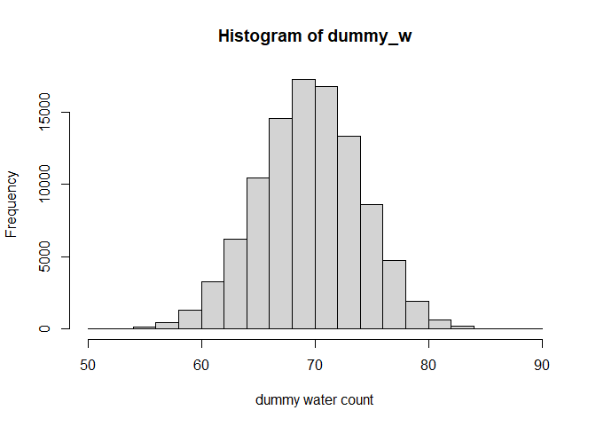
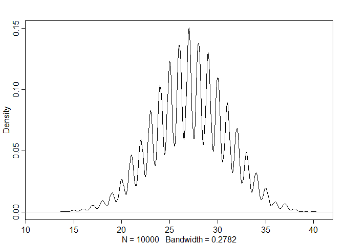

# Chapter 3: Sampling the Imaginary

## In-text code

Code is from Chapter 3 in the text book - but has additionally comments
etc. Note: I do not write up the code of all the in-text code examples.

### Vampire test

This is similar to the in-text code but have done things a little
differently

``` r
Pr_postive_vampire <- 0.95 # probability test is positive and person is a vampire
Pr_postive_nonvampire <- 0.01 # probability test is positive and person is not a vampire
Pr_vampire <- 0.001 # probability person is vampire
Pr_nonvampire <- 1 - Pr_vampire
Pr_vampire_postive <- (Pr_postive_vampire * Pr_vampire) / ((Pr_postive_vampire * Pr_vampire) + (Pr_postive_nonvampire * Pr_nonvampire))
Pr_vampire_postive
```

    ## [1] 0.08683729

### Sampling from a grid approximate posterior

``` r
p_grid <- seq(from = 0, to = 1, length.out = 1000)
prob_p <- rep(1, 1000)
prob_data <- dbinom(6, size = 9, prob = p_grid)
posterior <- prob_data * prob_p
posterior <- posterior / sum(posterior)

samples <- sample(p_grid, prob = posterior, size = 1e4, replace = TRUE)
plot(samples)

library(rethinking)
```

    ## Loading required package: rstan

    ## Loading required package: StanHeaders

    ## 
    ## rstan version 2.26.22 (Stan version 2.26.1)

    ## For execution on a local, multicore CPU with excess RAM we recommend calling
    ## options(mc.cores = parallel::detectCores()).
    ## To avoid recompilation of unchanged Stan programs, we recommend calling
    ## rstan_options(auto_write = TRUE)
    ## For within-chain threading using `reduce_sum()` or `map_rect()` Stan functions,
    ## change `threads_per_chain` option:
    ## rstan_options(threads_per_chain = 1)

    ## Do not specify '-march=native' in 'LOCAL_CPPFLAGS' or a Makevars file

    ## Loading required package: cmdstanr

    ## This is cmdstanr version 0.5.3

    ## - CmdStanR documentation and vignettes: mc-stan.org/cmdstanr

    ## - CmdStan path: C:/Users/debor/OneDrive/Documents/.cmdstan/cmdstan-2.32.1

    ## - CmdStan version: 2.32.1

    ## 
    ## A newer version of CmdStan is available. See ?install_cmdstan() to install it.
    ## To disable this check set option or environment variable CMDSTANR_NO_VER_CHECK=TRUE.

    ## Loading required package: parallel

    ## rethinking (Version 2.31)

    ## 
    ## Attaching package: 'rethinking'

    ## The following object is masked from 'package:rstan':
    ## 
    ##     stan

    ## The following object is masked from 'package:stats':
    ## 
    ##     rstudent


``` r
dens(samples)
```


### Sampling to summarize

``` r
# what is the posterior probability that the proportion of water is less that 0.5?
# this is using the calculated grid approximated posterior
sum(posterior[p_grid < 0.5])
```

    ## [1] 0.1718746

``` r
# this is using samples from the posterior
sum(samples < 0.5) / 1e4
```

    ## [1] 0.1719

``` r
# what is the posterior probability that the proportion of water is between 0.5 and 0.75?
sum(samples > 0.5 & samples < 0.75) / 1e4
```

    ## [1] 0.6017

``` r
# what are the bounds of the lower 80% posterior probability?
quantile(samples, 0.8) # 80% of the posterior distribution falls between 0 and 0.76
```

    ##       80% 
    ## 0.7617618

``` r
# what are the parameter values that bound the middle 80% posterior probability (i.e. centers on the parameter values with the highest frequency)
quantile(samples, c(0.1, 0.9)) # the parameter value that bounds the lower 10% and the lower 90% of the posterior distribution (between these two values lies the middle 80%)
```

    ##       10%       90% 
    ## 0.4454454 0.8178178

``` r
# comparing PI to HDPI 
p_grid <- seq(from = 0, to = 1, length.out = 1000)
prob_p <- rep(1, 1000)
prob_data <- dbinom(6, size = 9, prob = p_grid)
posterior <- prob_data * prob_p
posterior <- posterior / sum(posterior)

samples <- sample(p_grid, prob = posterior, size = 1e4, replace = TRUE)

# 80% probability mass 
PI(samples, prob = 0.8)
```

    ##       10%       90% 
    ## 0.4484484 0.8138138

``` r
HPDI(samples, prob = 0.8)
```

    ##      |0.8      0.8| 
    ## 0.4694695 0.8308308

``` r
# 95% probability mass
PI(samples, prob = 0.95)
```

    ##        3%       98% 
    ## 0.3483483 0.8798799

``` r
HPDI(samples, prob = 0.95)
```

    ##     |0.95     0.95| 
    ## 0.3613614 0.8878879

``` r
# Point estimates
# MAP ~ Maximum a posteriori estimate
p_grid[which.max(posterior)]
```

    ## [1] 0.6666667

``` r
chainmode(samples) # MAP generated from samples
```

    ## [1] 0.6542268

``` r
mean(samples) # mean generated from samples
```

    ## [1] 0.6356563

``` r
median(samples) # median generated from samples
```

    ## [1] 0.6426426

### Loss functions

``` r
# Loss proportional to distance of estimate from true estimate
sum(posterior * abs(0.5 - p_grid)) # for point estimate 0.5
```

    ## [1] 0.1640626

``` r
loss <- sapply(p_grid, function(d) sum(posterior * abs(d - p_grid))) # calculate loss for all possible point estimates
p_grid[which.min(loss)] # estimate that minimizes the loss function, is the same as the median
```

    ## [1] 0.6446446

### Sampling to simulate prediction

``` r
dbinom(0:2, size = 2, prob = 0.7) # generates probability of observing 0, 1, and 2 Waters when your sample size is 2 and the probability of water is 70%
```

    ## [1] 0.09 0.42 0.49

``` r
rbinom(1, size = 2, prob = 0.7) # generate one simulation of tossing the globe twice, with a probability of water of 70%. 
```

    ## [1] 2

``` r
rbinom(10, size = 2, prob = 0.7) # generate 10 simulations of tossing the globe twice with a probability of water of 70%
```

    ##  [1] 2 1 2 2 2 2 0 1 1 2

``` r
dummy_w <- rbinom(1e5, size = 2, prob = 0.7) # generate 100000 simulations of tossing a globe twice with a probability of of water of 70%
table(dummy_w)/1e5 # turns each simulation into a count of the number of times 0, 1, and 2 Waters were observed and divides that by the sample size.
```

    ## dummy_w
    ##       0       1       2 
    ## 0.08973 0.42090 0.48937

``` r
# showing if run again, the proabibilty of each observation changes slightly 
dummy_w <- rbinom(1e5, size = 2, prob = 0.7) # generate 100000 simulations of tossing a globe twice with a probability of of water of 70%
table(dummy_w)/1e5 # turns each simulation into a count of the number of times 0, 1, and 2 Waters were observed and divides that by the sample size.
```

    ## dummy_w
    ##       0       1       2 
    ## 0.08940 0.42137 0.48923

``` r
dummy_w <- rbinom(1e5, size = 9, prob = 0.7) # changing number of tosses in each simulation to 9 
hist(dummy_w, xlab = "dummy water count")
```


``` r
# changing sample size 
dummy_w <- rbinom(1e5, size = 15, prob = 0.7) # changing number of tosses in each simulation to 15 
hist(dummy_w, xlab = "dummy water count")
```


``` r
dummy_w <- rbinom(1e5, size = 100, prob = 0.7) # changing number of tosses in each simulation to 100 
hist(dummy_w, xlab = "dummy water count")
```



``` r
# changing probability of obeserving water 
dummy_w <- rbinom(1e5, size = 9, prob = 0.6) # changing prob of water to 0.6
hist(dummy_w, xlab = "dummy water count")
```


``` r
dummy_w <- rbinom(1e5, size = 9, prob = 0.4) # changing prob of water to 0.6
hist(dummy_w, xlab = "dummy water count")
```


### Model checking

``` r
# posterior predictive distributions 
w <- rbinom(1e4, size = 9, prob = 0.6) # generate 10000 simulations of 9 globe tosses with a probability of water of 0.6
simplehist(w)
```


``` r
# to propagate the uncertainty in each value of p, replace p with the samples of p generated from the posterior distribution 
p_grid <- seq(from = 0, to = 1, length.out = 1000)
prob_p <- rep(1, 1000)
prob_data <- dbinom(6, size = 9, prob = p_grid)
posterior <- prob_data * prob_p
posterior <- posterior / sum(posterior)

samples <- sample(p_grid, prob = posterior, size = 1e4, replace = TRUE)

w <- rbinom(1e4, size = 9, prob = samples) # generate 10000 simulations of 9 globe tosses with a probability of water of 0.6
simplehist(w)
```


## Practice Problems

### Posterior distribution to sample from for Easy problems

``` r
p_grid <- seq(from = 0, to = 1, length.out = 1000)
prior <- rep(1, 1000)
likelihood <- dbinom(6, size = 9, prob = p_grid)
posterior <- likelihood * prior
posterior <- posterior / sum(posterior)
set.seed(100)
samples <- sample(p_grid, prob = posterior, size = 1e4, replace = TRUE)
```

#### 3E1. How much of the posterior probability lies below p = 0.2?

``` r
sum(samples < 0.2) / 1e4
```

    ## [1] 4e-04

#### 3E2. How much of the posterior probability lies above p = 0.8?

``` r
sum(samples > 0.8) / 1e4
```

    ## [1] 0.1116

#### 3E3. How much of the posterior probability lies between p = 0.2 and p = 0.8?

``` r
sum(samples > 0.2 & samples < 0.8) / 1e4
```

    ## [1] 0.888

#### 3E4. 20% of the posterior probability lies below which value of p?

``` r
quantile(samples, 0.2)
```

    ##       20% 
    ## 0.5185185

#### 3E5. 20% of the posterior proabiltiy lies above which value of p?

``` r
quantile(samples, 0.8)
```

    ##       80% 
    ## 0.7557558

#### 3E6. Which values of p contain the narrowest interval equal to 66% of the posterior probabilty?

``` r
HPDI(samples, prob = 0.66) # HPDI calculates the highest posterior density interval (narrowest interval containing the specified probability mass)
```

    ##     |0.66     0.66| 
    ## 0.5085085 0.7737738

#### 3E7. Which values contain 66% of the posterior probability, assuming equal posteriro probability both above and below the interval?

``` r
PI(samples, prob = 0.66)
```

    ##       17%       83% 
    ## 0.5025025 0.7697698

``` r
### OR ####
quantile(samples, c(0.17, 0.83))
```

    ##       17%       83% 
    ## 0.5025025 0.7697698

#### 3M1. Suppose the globe tossing data had turned out to be 8 water in 15 tosses. Construct the posterior distribution, using grid approximation. Use the same flat prior as before.

``` r
p_grid <- seq(from = 0, to = 1, length.out = 1000)
prior <- rep(1, 1000)
likelihood <- dbinom(8, size = 15, prob = p_grid)
posterior <- likelihood * prior
posterior <- posterior / sum(posterior)

plot(p_grid, posterior, type = "b", xlab = "probability of water")
```


#### 3M2. Draw 10000 samples from the grid approximation above. The use the samples to calculated the 90% HPDI for p.

``` r
samples <- sample(p_grid, prob = posterior, size = 1e4, replace = TRUE)
HPDI(samples, prob = 0.9)
```

    ##      |0.9      0.9| 
    ## 0.3293293 0.7167167

``` r
# 0.3293293 - 0.7167167
```

#### 3M3. Construct a posterior predictive check for this model and data. This means simulate the distribution of samples, averaging over the posterior uncertainty p. What is the probability of observing 8 water in 15 tosses?

``` r
posterior_predictive_dist <- rbinom(1e4, size = 15, prob = samples)
simplehist(posterior_predictive_dist)
```


``` r
table(posterior_predictive_dist) / 1e4
```

    ## posterior_predictive_dist
    ##      0      1      2      3      4      5      6      7      8      9     10 
    ## 0.0005 0.0034 0.0108 0.0295 0.0520 0.0853 0.1160 0.1366 0.1444 0.1355 0.1129 
    ##     11     12     13     14     15 
    ## 0.0837 0.0518 0.0270 0.0088 0.0018

``` r
# Probability of 8 waters is 0.1428
```

#### 3M4. Using the posterior distribution cosntructed from the new (8/15) data, now calculate the probabilty of observing 6 water in 9 tosses

``` r
posterior_predictive_dist <- rbinom(1e4, size = 9, prob = samples)
simplehist(posterior_predictive_dist)
```


``` r
table(posterior_predictive_dist) / 1e4
```

    ## posterior_predictive_dist
    ##      0      1      2      3      4      5      6      7      8      9 
    ## 0.0060 0.0290 0.0758 0.1312 0.1930 0.2118 0.1751 0.1132 0.0527 0.0122

``` r
# Probability of 6 waters is 0.1696
```

#### 3M5. Start over at 3M1, but now use a prior that is zero below p = 0.5 and a constant above p = 0.5. This corresponds to prior information that a majority of the Earth’s surface is water. Repeat each problem above and compare the inferences. What differences does the better prior make? If it helps, compare inferences (using both prior to the true value p = 0.7)

``` r
#### Constructing the new posterior ####
p_grid <- seq(from = 0, to = 1, length.out = 1000)
prior <-  ifelse(p_grid < 0.5, 0, 1)

likelihood <- dbinom(8, size = 15, prob = p_grid)
posterior <- likelihood * prior
posterior <- posterior / sum(posterior)

plot(p_grid, posterior, type = "b", xlab = "probability of water")
```


``` r
#### HPDI with 90% mass probability ####
samples <- sample(p_grid, prob = posterior, size = 1e4, replace = TRUE)
HPDI(samples, prob = 0.9)
```

    ##      |0.9      0.9| 
    ## 0.5005005 0.7117117

``` r
# 0.5005005 - 0.7117117

### Probability of 8 waters in 15 tosses ####
posterior_predictive_dist <- rbinom(1e4, size = 15, prob = samples)
simplehist(posterior_predictive_dist)
```


``` r
table(posterior_predictive_dist) / 1e4
```

    ## posterior_predictive_dist
    ##      2      3      4      5      6      7      8      9     10     11     12 
    ## 0.0006 0.0032 0.0152 0.0331 0.0703 0.1152 0.1589 0.1763 0.1662 0.1268 0.0772 
    ##     13     14     15 
    ## 0.0382 0.0154 0.0034

``` r
# Probability of 8 waters is 0.1568

#### Probability of 6 waters in 9 tosses ####
posterior_predictive_dist <- rbinom(1e4, size = 9, prob = samples)
simplehist(posterior_predictive_dist)
```


``` r
table(posterior_predictive_dist) / 1e4
```

    ## posterior_predictive_dist
    ##      0      1      2      3      4      5      6      7      8      9 
    ## 0.0005 0.0061 0.0287 0.0784 0.1610 0.2269 0.2415 0.1600 0.0786 0.0183

``` r
# Probability of 6 waters is 0.2329

#### Thoughts on inference ####
# The 90% HPDI is much narrower and is closer to the true value p = 0.7
# The probability of 8 waters in 15 tosses increased as well as the probability of 6 waters in 9 tosses, this makes sense as the proportion of water estiamted from those tosses would be 0.53 and 0.67 which is all above 0.5. 
```

#### 3M6. Suppose you want to estimate the Earth’s proportion of water very precisely. Specifically, you want the 99% percentile interval of the posterior distribution p to only be 0.05 wide. This means the distance between the upper and loster bound of the interval should be 0.05. How many times will you have to toss the globe to do this?

``` r
### this is assuming an uninformative prior and a getting waters in proportion to the "true" proportion of water on the earth. Just doing this by trial and error but there is likely a better way.
### 10 tosses 
p_grid <- seq(from = 0, to = 1, length.out = 1000)
prior <- rep(1, 1000)
likelihood <- dbinom(7, size = 10, prob = p_grid)
posterior <- likelihood * prior
posterior <- posterior / sum(posterior)

samples <- sample(p_grid, prob = posterior, size = 1e4, replace = TRUE)
PI_99 <- PI(samples, prob = 0.99)
PI_99[2] - PI_99[1]
```

    ##      100% 
    ## 0.6206306

``` r
# Width is 0.6206306

### 1000 tosses 
p_grid <- seq(from = 0, to = 1, length.out = 1000)
prior <- rep(1, 1000)
likelihood <- dbinom(700, size = 1000, prob = p_grid)
posterior <- likelihood * prior
posterior <- posterior / sum(posterior)

samples <- sample(p_grid, prob = posterior, size = 1e4, replace = TRUE)
PI_99 <- PI(samples, prob = 0.99)
PI_99[2] - PI_99[1]
```

    ##       100% 
    ## 0.07307808

``` r
# Width is 0.074

#### 2000 tosses 
p_grid <- seq(from = 0, to = 1, length.out = 1000)
prior <- rep(1, 1000)
likelihood <- dbinom(1400, size = 2000, prob = p_grid)
posterior <- likelihood * prior
posterior <- posterior / sum(posterior)

samples <- sample(p_grid, prob = posterior, size = 1e4, replace = TRUE)
PI_99 <- PI(samples, prob = 0.99)
PI_99[2] - PI_99[1]
```

    ##       100% 
    ## 0.05405405

``` r
# Width is 0.052

#### 3000 tosses 
p_grid <- seq(from = 0, to = 1, length.out = 1000)
prior <- rep(1, 1000)
likelihood <- dbinom(2100, size = 3000, prob = p_grid)
posterior <- likelihood * prior
posterior <- posterior / sum(posterior)

samples <- sample(p_grid, prob = posterior, size = 1e4, replace = TRUE)
PI_99 <- PI(samples, prob = 0.99)
PI_99[2] - PI_99[1]
```

    ##       100% 
    ## 0.04304304

``` r
# Width is 0.042

#### 2500 tosses 
p_grid <- seq(from = 0, to = 1, length.out = 1000)
prior <- rep(1, 1000)
likelihood <- dbinom(1750, size = 2500, prob = p_grid)
posterior <- likelihood * prior
posterior <- posterior / sum(posterior)

samples <- sample(p_grid, prob = posterior, size = 1e4, replace = TRUE)
PI_99 <- PI(samples, prob = 0.99)
PI_99[2] - PI_99[1]
```

    ##       100% 
    ## 0.04704705

``` r
# Width is 0.047

#### 2250 tosses 
p_grid <- seq(from = 0, to = 1, length.out = 1000)
prior <- rep(1, 1000)
likelihood <- dbinom(1575, size = 2500, prob = p_grid)
posterior <- likelihood * prior
posterior <- posterior / sum(posterior)
plot(p_grid, posterior)
```


``` r
samples <- sample(p_grid, prob = posterior, size = 1e4, replace = TRUE)
PI_99 <- PI(samples, prob = 0.99)
PI_99[2] - PI_99[1]
```

    ##       100% 
    ## 0.05005005

``` r
# Width is 0.049
```

### Data for hard problems

``` r
birth1 <- c(1,0,0,0,1,1,0,1,0,1,0,0,1,1,0,1,1,0,0,0,1,0,0,0,1,0,0,0,0,1,1,1,0,1,0,1,1,1,0,1,0,1,1,0,1,0,0,1,1,0,1,0,0,0,0,0,0,0,1,1,0,1,0,0,1,0,0,0,1,0,0,1,1,1,1,0,1,0,1,1,1,1,1,0,0,1,0,1,1,0,1,0,1,1,1,0,1,1,1,1)
birth2 <- c(0,1,0,1,0,1,1,1,0,0,1,1,1,1,1,0,0,1,1,1,0,0,1,1,1,0,1,1,1,0,1,1,1,0,1,0,0,1,1,1,1,0,0,1,0,1,1,1,1,1,1,1,1,1,1,1,1,1,1,1,1,0,1,1,0,1,1,0,1,1,1,0,0,0,0,0,0,1,0,0,0,1,1,0,0,1,0,0,1,1,0,0,0,1,1,1,0,0,0,0)

data(homeworkch3)

sum(birth1) + sum(birth2) # number of boys born 
```

    ## [1] 111

#### 3H1. Using grid approximation, compute the posterior distribution for the probability of a birth being a boy. Assume a uniform probability. Which parameter value maximizes the posterior probabiltiy?

``` r
p_grid <- seq(from = 0, to = 1, length.out = 1000)
prior <- rep(1, 1000)
likelihood <- dbinom(111, size = 200, prob = p_grid)
posterior <- likelihood * prior
posterior <- posterior / sum(posterior)
plot(p_grid, posterior)
```


``` r
p_grid[which.max(posterior)]
```

    ## [1] 0.5545546

``` r
#### OR ####
# if sampling from posterior
samples <- sample(p_grid, prob = posterior, size = 1e4, replace = TRUE)
chainmode(samples)
```

    ## [1] 0.5566343

``` r
# can use median or mode since is a normal distribution
mean(samples)
```

    ## [1] 0.5540712

``` r
median(samples)
```

    ## [1] 0.5545546

3H2. Using the sample function, draw 10000 random parameter values from
the posterior distribution you calculated above. Use the samples to
estimate the 50%, 89% and 97% highest posterior density interval.

``` r
# already sampled above 
HPDI(samples, prob = 0.5)
```

    ##      |0.5      0.5| 
    ## 0.5305305 0.5775776

``` r
HPDI(samples, prob = 0.89)
```

    ##     |0.89     0.89| 
    ## 0.4964965 0.6076076

``` r
HPDI(samples, prob = 0.97)
```

    ##     |0.97     0.97| 
    ## 0.4774775 0.6276276

#### 3H3. Use rbinom to simulate 10000 replicates of 200 births. You should end up with 10000 numbers each one a count of boys out of 200 births. Compare the distribution of the predicted numbers of boys to the actual count in the data (111 boys out of 200 births). There are many good ways to visualize the simulations, but the dens command (rethinking package) is probably the easiest way in this case. Does it look like the models fits the data well? That is does the distribution of the predictions include the actual observation as a central likely outcome?

``` r
posterior_predictive_dist <- rbinom(1e4, size = 200, prob = samples)
dens(posterior_predictive_dist)
```


``` r
simplehist(posterior_predictive_dist)
```


``` r
# Yes it looks like the model fits the data well.
```

#### 3H4. Now compare 10000 counts of boys from 100 simulated first borns only to the number of boys in the first births, birth1. How does the model look in this light?

``` r
posterior_predictive_dist <- rbinom(1e4, size = 100, prob = samples)
sum(birth1)
```

    ## [1] 51

``` r
dens(posterior_predictive_dist)
```


``` r
simplehist(posterior_predictive_dist)
```


``` r
# doesn't do as good a job. The observation of 51 boys in first set of births in a family is not centeral in the posterior predictive distribution. 
```

#### 3H5. The model assumes that the sex of the first and second births are independent. To check this assumption, focus now on the second set of births that followed female first borns. Compare 10000 simulated counts of boys to only those second births that followed girls. To do this correctly, you need to count the number of first borns who were girls and simulate that many births, 10000 times. Compare the counts of boys in your simulations to the actual observed count of boys following girls. How does the model look in this light? Any guesses what is going on in these data?

``` r
100 - sum(birth1) # 49 first borns were girls
```

    ## [1] 49

``` r
posterior_predictive_dist <- rbinom(1e4, size = 49, prob = samples)
dens(posterior_predictive_dist)
```



``` r
simplehist(posterior_predictive_dist)
```


``` r
## number of boys that followed girls 
family_births <- cbind(birth1, birth2) # combine first and second births together (can see for each family what the first and second birth are in a table).

family_birth1_girls <- subset(family_births, birth1 == 0) # subset set so we only have families that had girls as the first born

family_birth1_girls <- as.data.frame(family_birth1_girls)
sum(family_birth1_girls$birth2)
```

    ## [1] 39

``` r
# Of families were the first born was a girl (49), 39 had boys as their second birth

# Seemingly the births are not independent, 39/49 families that had girls first had boys second, based on the full data set we would expect the posterior predictive distribution that does 10000 simulations of 49 families to in general have around 26 or so boys not 39. 
```
